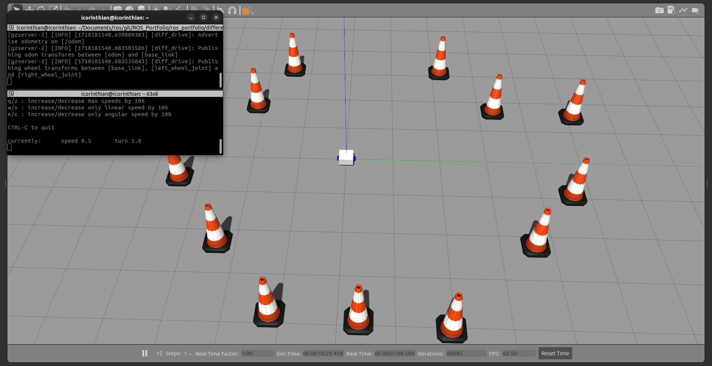
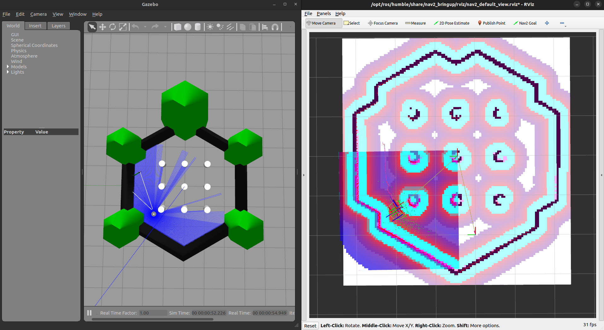
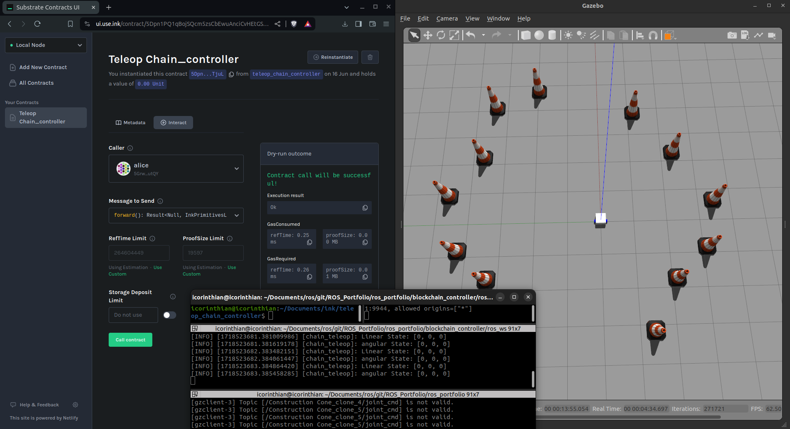

# ROS2 Robotics Portfolio

Welcome to my ROS 2 Robotics Portfolio! This repository showcases a series of projects I have developed to demonstrate my skills and expertise in robotics using the Robot Operating System (ROS 2). Each project is designed to highlight different aspects of robotics, including simulation, control, navigation, and computer vision.

## Projects

### 1. ROS2 Differential Drive Robot Simulation
**Description:**  
A simple URDF model of a differential drive robot, simulated in Gazebo and controlled via keyboard teleoperation. This project includes a custom-made URDF specifically designed to work seamlessly with Gazebo. Additionally, I have written a launch file to facilitate the easy opening of the simulation environment in Gazebo. To control the robot, you can use the `teleop_keyboard` package.

#### 1. Launch Simulation 

   ```bash
   ros2 launch dds_package launch_gazebo_sim.launch.py
   ```
#### 2. Run Teleop_Keybord

   ```bash
   ros2 run teleop_twist_keyboard teleop_twist_keyboard
   ```

**Skills Expressed:**
- **URDF Modeling:** Custom creation of a URDF (Unified Robot Description Format) file to define the robot's physical and visual properties.
- **Simulation:** Setting up and running simulations in Gazebo to test and visualize robot behaviors.
- **Launch Files:** Writing ROS 2 launch files to streamline the process of starting up the robot simulation.
- **Teleoperation:** Implementing keyboard teleoperation to manually control the robot, showcasing knowledge of ROS 2 topic publishing and subscribing.

**Preview**


[_click here for project demo_](ros_portfolio/differential_drive_sim/ros_ws/src/dds_package/img/project1.mp4)

### 2. TurtleBot3 Simulation and Navigation
**Description:**  
This project demonstrates navigation and obstacle avoidance for TurtleBot3 in a simulated environment using the ROS 2 navigation stack and Gazebo. It utilizes custom launch files to start mapping and subsequently use the generated map for navigation.

**Key Features:**
- **Simulation Environment:** Uses Gazebo to simulate the TurtleBot3 and its environment, providing a realistic testbed for developing and testing navigation algorithms.
- **Custom Launch Files:** Custom launch files are created to facilitate the mapping process, allowing for easy setup and execution of the mapping and navigation tasks.
- **Mapping:** Implements SLAM (Simultaneous Localization and Mapping) to generate a map of the environment, which is crucial for effective navigation and obstacle avoidance.
- **Navigation:** Utilizes the generated map to navigate through the environment, demonstrating path planning, real-time obstacle avoidance, and goal-reaching capabilities.

**Skills Demonstrated:**
- **ROS 2 Proficiency:** Showcases advanced knowledge of ROS 2, including working with nodes, topics, services, and the ROS 2 navigation stack.
- **Robot Simulation:** Experience in setting up and configuring robot simulations using Gazebo.
- **SLAM Techniques:** Practical application of SLAM for real-time mapping and localization in a dynamic environment.
- **Navigation and Control:** Development of navigation strategies, including path planning and obstacle avoidance.
- **Launch File Creation:** Proficiency in creating and managing custom ROS 2 launch files to streamline complex robot operations.
- **Problem-Solving:** Demonstrates the ability to integrate multiple components and solve practical robotics problems.

#### 1. Launch Map genration 

   ```bash
   ros2 launch turtle_nav_sim slam_map_genarate.launch.py
   ```
   ```bash
   ros2 run nav2_map_server map_saver_cli -f {path to save the genrated map}
   ```
#### 2. launch Turtlebot3 sim for navigation

   ```bash
   ros2 launch turtle_nav_sim nav2_sim.launch.py 
   ```   

- The above Launch file assumes path the map was saved is [ros_portfolio/nav2_sim/ros_ws/src/turtle_nav_sim/map]

**Preview**


[_click here for project demo_](ros_portfolio/nav2_sim/ros_ws/src/turtle_nav_sim/img/project2.mp4)

### 3. ROS 2 Blockchain-Based Robot Control
**Description:**  
This project integrates blockchain technology with ROS 2 to control a robot. The `blockchain_controller` package includes a node named `chain_teleop` that connects to a locally running Substrate blockchain. It retrieves state data from an ink! contract deployed on the blockchain, which outputs linear and angular values for a `Twist` message. These values are then published to the `cmd_vel` topic, enabling blockchain-based control of the robot.

**Key Features:**
- **Blockchain Integration:** Utilizes blockchain technology to fetch control commands from a smart contract, demonstrating a novel approach to robot control.
- **Substrate and ink!:** Leverages Substrate for blockchain development and ink! for writing the smart contract that provides the control commands.
- **ROS 2 Node Communication:** Implements a ROS 2 node that communicates with the blockchain, retrieves data, and publishes the corresponding velocity commands.
- **Decentralized Control:** Highlights the potential of decentralized systems in robotics, ensuring secure and tamper-proof command and control mechanisms.

**Skills Demonstrated:**
- **Blockchain Proficiency:** Knowledge and experience with blockchain technologies, particularly Substrate and ink! for smart contract development.
- **ROS 2 Expertise:** Advanced understanding of ROS 2, including creating nodes, publishing/subscribing to topics, and integrating external data sources.
- **Innovative Control Methods:** Exploration of new methods for robot control, showcasing the integration of emerging technologies with traditional robotics frameworks.
- **Smart Contract Development:** Ability to develop and deploy smart contracts that interact with robotics systems.
- **System Integration:** Demonstrates the ability to integrate blockchain technology with ROS 2 for practical applications in robotics.

#### 1. Deploy the ink! Contract

   Certainly! Here's a small summary for setting up a Substrate contract node and deploying an ink! contract, along with links to Substrate documentation for further details:

#### Setting Up a Substrate Contract Node and Deploying an ink! Contract

1. **Setting Up a Substrate Node:**
   - Install Substrate by following the instructions provided in the [Substrate Developer Hub](https://substrate.dev/docs/en/).
   - Initialize your Substrate node with the appropriate runtime environment for smart contracts.

2. **Developing an ink! Smart Contract:**
   - Create your ink! smart contract using the [ink! Smart Contract Tutorial](https://substrate.dev/substrate-contracts-workshop/#/).
   - Ensure your contract includes the necessary logic to output control commands (linear and angular values for `Twist` messages in this case).

3. **Compiling and Deploying the ink! Contract:**
   - Compile your ink! smart contract using the ink! CLI tools.
   - Deploy the compiled contract to your local Substrate node or a testnet.
   - Verify the deployment and interaction capabilities of your contract.

For this example, deploy this [ink! contract](ros_portfolio/blockchain_controller/ros_ws/src/blockchain_controller/contracts/teleop_chain_controller.contract) directly to the locally running Substrate node.

#### Resources:
- [Substrate Developer Hub](https://substrate.dev/docs/en/): Comprehensive documentation for setting up and deploying Substrate nodes.
- [ink! Smart Contract Tutorial](https://substrate.dev/substrate-contracts-workshop/#/): Step-by-step guide for developing ink! smart contracts.
- [ink! Documentation](https://paritytech.github.io/ink/): Detailed reference for ink! smart contract development and deployment.

#### 2. Launch the gazebo with the bot

   ```bash
   ros2 launch dds_package launch_gazebo_sim.launch.py
   ```

#### 3. Launch the Blockchain Controller Node

   ```bash
   ros2 run blockchain_controller chain_teleop --contract_address "contract address here"
   ```

- Ensure that the Substrate blockchain is running locally and the ink! contract is deployed correctly.
- The `chain_teleop` node will automatically connect to the blockchain, retrieve the necessary data, and publish the velocity commands to `cmd_vel`.

**Preview**


[_click here for project demo_](ros_portfolio/blockchain_controller/ros_ws/src/blockchain_controller/img/project3.mp4)

Each project includes detailed documentation, setup instructions, and usage examples to help you understand and replicate the work. Feel free to explore the repositories and try out the projects on your own setup!

Thank you for visiting my portfolio. If you have any questions or feedback, please don't hesitate to reach out.
